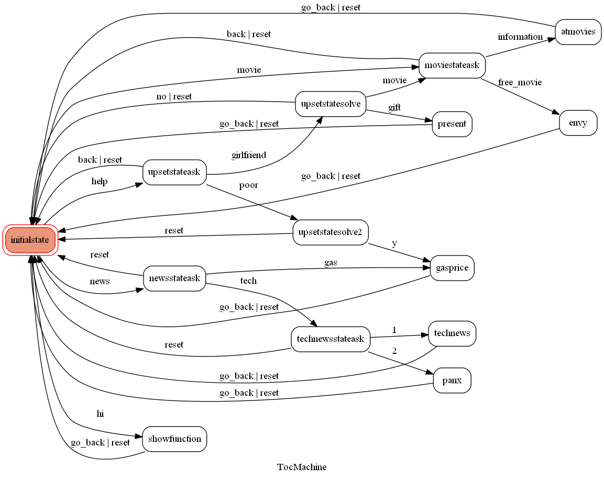

# Helper Linebot

A Linebot based on a finite state machine

Bot名稱 : TocRobot_PLS_say_hi
Bot ID ： @948dwevd


## Setup

### Prerequisite
* Python 3
* HTTPS Server

#### Install Dependency
```sh
pip3 install -r requirements.txt
```

## Finite State Machine


## Note
If you don't know how to deal with the current state, simply type "reset" to get back to initial state.
